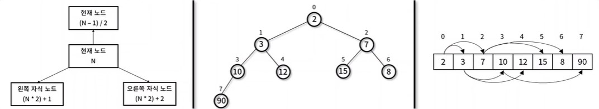

# 힙 (Heap)
- 최대값 혻은 최솟값을 빠르게 찾기 위해 완전이진트리 형태로 연산을 수행하는 자료구조
- 힙 대표 속성
    - 정렬 : 각 노드의 값은 자식 노드가 가진 값보다 작거나 혹은 큰 순서대로 정렬된다.
    - 형태 : 트리의 형태는 완전이진트리 모양이다.
- 힙 종류 
    - 최소 힙 : 부모 노드의 값이 자식 노드의 값보다, 작거나 같은 완전 이진 트리
    - 최대 힙 : 부모 노드의 값이 노드의 값보다, 크거나 같은 완전 이진틑리

- 힙 구현
    - 완전 이진트리 성질을 만족하기 때문에 1차원 배열로 표현이 가능하다
    - 현재 노드 : N, 부모 노드 : (N-1) / 2, 왼쪽 자식 노드 : (N *2) +1, 오른쪽 자식 노드 (N *2) + 2
    


- 구현 할 메서드
    - Heap.parentIndex() : 부모 노드의 위치 반환
    - Heap.letfChildIndex() : 왼쪽 자식 노드의 위치 반환
    - Heap.rightChildIndex() : 오른쪽 자식 노드의 위치 반환
    - Heap.parent() : 부모 노드의 요소 값 반환
    - Heap.letfChild() : 부모 노드의 요소 값 반환
    - Heap.rightChild() : 부모 노드의 요소 값 반환
    - Heap.peak() : 현재 정렬된 최소/최대 요소 값 반환
    - Heap.size() : 현재 배열 내 크기 반환
    - Heap.insert()  : 신규 노드 추가
    - Heap.bubbleUp() : 추가된 노드 위치 정렬
    - Heap.extract() : root 노드 반환 및 삭제
    - Heap.bubbleDown() : 대체된 root 노드 위치를 기준으로 정렬

## 힙 구현하기 
```javascript
// 최소힙 (MinHeap)
// Heap() : 배열 내 요소를 저장하기 위한 생성자
function Heap() {
    this.items = []
}

// swap() : 배열 내 두 요소 위치를 변경
Heap.prototype.swap = function (index1, index2){
    let temp = this.items[index1]
    this.items[index1] = this.items[index2]
    this.items[index2] = temp
}
// parentIndex() : 부모 노드의 위치 반환
Heap.prototype.parentIndex = function(index) {
    return Math.floor((index-1) /2)
}

// leftChildIndex() : 왼쪽 자식 노드의 위치 반환
Heap.prototype.leftChildIndex = function (index) {
    return index * 2 + 1
}

// rightChildIndex() : 오른쪽 자식 노드의 위치 반환
Heap.prototype.rightChildIndex = function (index) {
    return index * 2 + 2
}
// parent () : 부모 노드의 요소 값 반환
Heap.prototype.parent = function (index) {
    return this.items[this.parentIndex(index)]
}


// leftChild () : 부모 노드의 요소 값 반환
Heap.prototype.leftChild = function (index) {
    return this.items[this.leftChildIndex(index)]
}

// rightChild () : 부모 노드의 요소 값 반환
Heap.prototype.rightChild = function (index) {
    return this.items[this.rightChildIndex(index)]
}

// peak() : 현재 정렬된 최소/최대 요소 값 반환
Heap.prototype.peak = function() {
    return this.items[0]
}

// size() : 현재 배열 내 크기 반환
Heap.prototype.size = function(){
    return this.items.length
}

// insert() : 신규 노드 추가
Heap.prototype.insert = function(item) {
    this.items[this.size()] = item
    this.bubbleUp()
}


// bubbleUp() : 추가된 노드 위치 정렬
// 최대 힙은 부등호를 반대로 변경하면 구현이 가능하다.
Heap.prototype.bubbleUp = function () {
    let index = this.size() - 1
    while (this.parent(index) && this.parent(index) > this.items[index]){
        this.swap(this.parentIndex(index) , index)
        index = this.parentIndex(index)
    }
}

// extract(): root 노드 반환 및 삭제
Heap.prototype.extract = function () {
    let item = this.items[0]
    this.items[0] = this.items[this.size() - 1]
    this.items.pop()
    this.bubbleDown()
    return item
}
  
// bubbleDown(): 대체된 root 노드 위치를 기준으로 정렬
// 최대 힙은 부등호를 반대로 변경하면 구현이 가능하다.
Heap.prototype.bubbleDown = function () {
    let index = 0
    while (
    this.leftChild(index) &&
    (this.leftChild(index) < this.items[index] ||
        this.rightChild(index) < this.items[index])
    ) {
    let childIndex = this.leftChildIndex(index)
    if (
        this.rightChild(index) &&
        this.rightChild(index) < this.items[childIndex]
    ) {
        childIndex = this.rightChildIndex(index)
    }

    this.swap(childIndex, index)
    index = childIndex
    }
}

let minHeap = new Heap()

minHeap.insert(90)
minHeap.insert(15)
minHeap.insert(10)
minHeap.insert(7)
minHeap.insert(12)
minHeap.insert(2)
minHeap.insert(8)
console.log(minHeap) // [2, 10, 7, 90, 12, 15, 8]
minHeap.insert(3)
console.log(minHeap) // [2, 3, 7, 10, 12 ,15 ,8, 90]

console.log(minHeap.extract()) // 2
console.log(minHeap) //  [3, 10 , 7, 90, 12, 15, 8]
console.log(minHeap.extract()) // 3
console.log(minHeap.extract()) // 7
console.log(minHeap.extract()) // 8
console.log(minHeap.extract()) // 10
console.log(minHeap.extract()) // 12
console.log(minHeap.extract()) // 15
console.log(minHeap.extract()) // 90

```