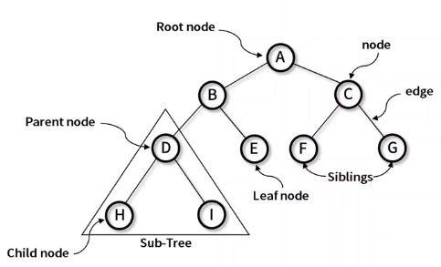
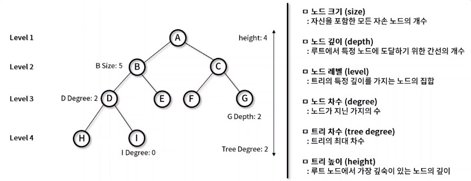
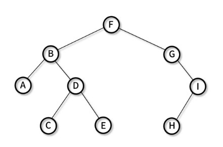

# 트리 (Tree)
- 그래프의 일종으로 두 노드 사이의 하나의 간선만 연결되어 있는, 최소 연결과 계층 형태의 비선형 자료구조이다
- 트리의 구조 및 용어 



- 노드(node) : 하나 이상의 값을 갖는 객체 단위
- 간선(edge) : 두 노드를 연결하는 선
- 루트 노드(Root node) : 부모가 없는 최상위 노드
- 단말 노드(Leaf node) : 자식이 없는 노드
- 부모 노드(Parent node) : 특정 Sub-Tree 내에서의 상위 노드
- 자식 노드(Child node) : 특정 Sub-Tree 내에서의 하위 노드
- 형제(Sibling) : 같은 부모를 가르키고 있고 Depth가 같은 노드의 관계

## 트리 특징
- 주요 특징 : `최소 연결 트리`로 불림, 계층 모델, 방향 비순환 그래프(DAG : Directed Acyclic Graph) 한 종류
- 트리 종류: 이진트리, 이진 탐색 트리, AVL 트리, 힙(Heap)등이 있다.



## 트리 순회
- 트리 구조에서 각각의 노드를 정확히 한 번씩 체계적인 방법으로 방문하는 과정
- 필요 용어
  - N(Ndoe) : 해당 노드를 방문
  - L(Left) : 왼쪽 서브 트리로 이동
  - R(Right) : 오른쪽 서브 트리로 이동
- 순회 방식
  - 전위 순회(Pre-order): N-L-R
  - 중위 순회(In-order): L-N-R
  - 후위 순회(Post-order): L-R-N
  - 층별 순회(Lever-order) : 낮은 Level부터 순차적으로 순회

## 전위 순회 (Pre-order)
- 전위 순회(Pre-order): N-L-R 
1. 노드를 방문한다
2. 왼쪽 서브 트리를 전위 순회한다.
3. 오른쪽 서브 트리를 전위 순회한다.



- 방문 순서 F-> B -> A -> D -> C -> E -> G -> I -> H
- 의사 코드(pseudo-code)
```
preorder(node)
  print node.value
  if node.left != null  then proorder(node.left)
  if node.right != null  then proorder(node.right)
```

## 중위 순회(In-order)
- 중위 순회(In-order): L-N-R
1. 왼쪽 서브 트리를 중위 순회한다.
2. 현재 노드를 방문한다.
3. 오른쪽 서브 트리를 중위 순회한다.


- 방문 순서 A -> B -> C -> D -> E -> F -> G -> H -> I
- 의사 코드(pseudo-code)
```
inorder(node)
  
  if node.left != null  then proorder(node.left)
  print node.value
  if node.right != null  then proorder(node.right)
```

## 후위 순회(Post-order): L-R-N
- 후위 순회(Post-order): L-R-N
1. 왼쪽 서브 트리를 후위 순회한다.
2. 오른쪽 서브 트리를 후위 순회한다.
3. 현재 노드를 방문한다.


- 방문 순서 A -> C -> E -> D -> B -> H -> I -> G -> F
- 의사 코드(pseudo-code)


## 층별 순회 (Lever-order)
- 층별 순회(Lever-order) : 낮은 Level부터 순차적으로 순회
1. root 노드 방문
2. Level 증가
3. 왼쪽에서 오른쪽 순으로 방문


- 방문 순서 F -> B -> G -> A -> D -> I -> C -> E -> H
- 의사 코드(pseudo-code)
```
levelorder(node)
  q.enqueue(root)
  while not q.empty do
    node := q.dequeue()
    print node.value
    if node.left != null q.enqueue(node.left)
    if node.right != null  q.enqueue(node.right)
```

