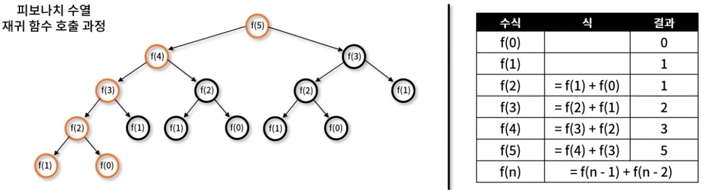

# 동적 계획법 ( Dynamic programing )
- Memoization로 중복 연산을 방지하며, 작은 부분 문제로 큰 문제를 해결하며 해를 도출하는 알고리즘 설계 기법
- 동적 계획법 특징
    - 부문 문제는 중복되며, 상위 문제 해결 시 재사용
    - Memoization 기법을 사용 ( 동일한 계산을 반복할 때, 이전에 계산한 값을 메모리에 저장하여 중복 연산 방지)



- 전체를 탐색하지 않고 주황색 테두리 부분만 탐색해 중복되는 요소는 호출하지 않음

## 동적 계획법 예제
- 피보나치 수열을 Memoization을 사용해 구현
```javascript
/* top-down */
function fibo_td(n, d = []){
    if ( n < 2 ) return n
    if (d[n]) return d[n]

    d[n] = fibo_td(n-1) + fibo_td(n-2)
    
    return d[n]
}
console.log(fibo_td(5))


/* bottom-up */

function fibo_bu(n, d = []){
    d[0] = 0
    d[1] = 1
    for(let i = 2; i <= n; i++){
        d[i] = d[i-1] + d[i-2]
    }
    return d[n]
}
console.log(fibo_bu(5))
```

