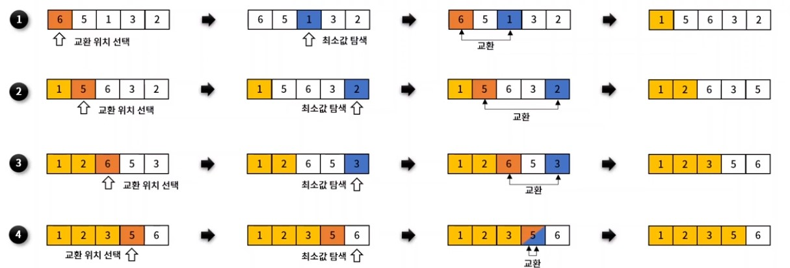
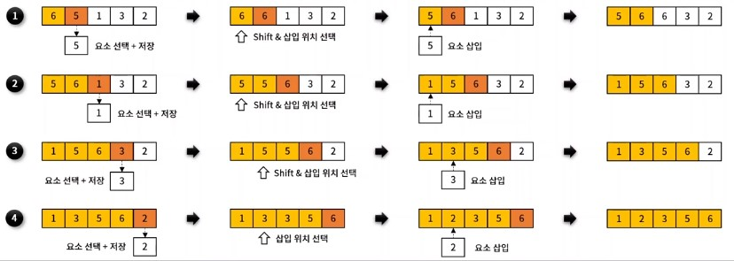
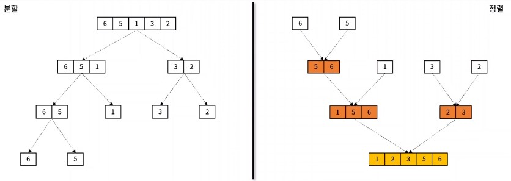
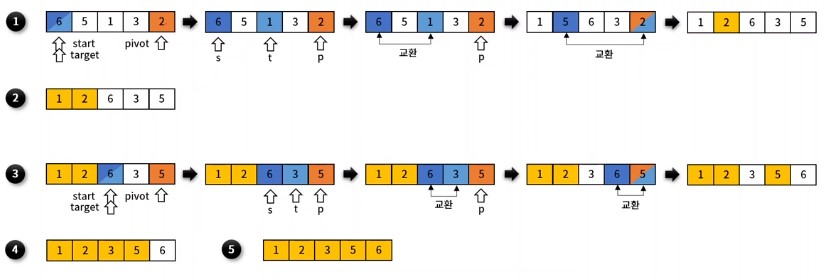

# 정렬 (Sorting)
- 배열 내 원소들을 번호순이나 사전 순서와 같이 일정한 순서대로 열거하는 알고리즘
- 대표 정렬 알고리즘 별 구현 함수
  - 검품 정렬 - On^2
  - 선택 정렬 - On^2
  - 삽입 정렬 - On^2
  - 병합 정렬 - O(nlogn)
  - 퀵 정렬 - O(nlogn)

## 거품 정렬 ( Bubble sort )
- 서로 인접한 두 원소를 비교하면서 정렬하는 알고리즘
- 평균 시간 복잡도 : O(n^2)


## 선택 정렬 ( Selection Sort )
- 최솟값을 찾아 데이터 영역의 가장 앞으로 이동하는 방식을 반복하여 전체 데이터 영역을 정렬하는 알고리즘
- 평균 시간 복잡도 : O(n^2)



## 삽입 정렬 ( Insertion Sort )
- 이미 정렬된 데이터 영역과 비교하면서, 자신의 위치를 찾아 요소를 삽입하여 정렬하는 알고리즘
- 평균 시간 복잡도 : O(n^2)



## 병합 정렬 ( Merge Sort )
- 하나의 배열을 두 개의 균등한 크기로 분할하고, 부분 정렬하며, 이를 다시 합하면서 전체를 정렬해가는 알고리즘
- 평균 시간 복잡도 : O(nlogn)



## 퀵 정렬 (Quick Sort )
- 특정한 값(pivot)을 기준으로 큰 숫자와 작은 숫자를 분할하여 정렬하는 알고리즘
- 평균 시간 복잡도 : O(nlogn)



## 정렬 구현하기
```javascript
let swap = function (arr, idx_1, idx_2) {
  let tmp = arr[idx_1]
  arr[idx_1] = arr[idx_2]
  arr[idx_2] = tmp
}


// 편의를 위한 코드 최적화 
let ascending = function (x, y){
  return x > y
}

let descending = function (x, y){
  return x < y
}

// 삽입 정렬
let bubbleSort = function (arr, compare){
  for (let i =0; i < arr.length - 1; i++){
    for (let j = 0; j < arr.length - i; j++){
      if(compare(arr[j], arr[j +1])){
        swap(arr, j, j+1)
      }
    }
  }
}

// 선택 정렬
let selectSort = function (arr, compare){
  for (let i = 0; i < arr.length; i++){
    let k = i;
    for (let j = i + 1; j < arr.length; j++){
      if(compare(arr[k], arr[j])) k = j
    }
    swap(arr, i, k)
  }
}

// 삽입 정렬
let insertionSort = function (arr, compare){
  for(let i = 1; i < arr.length; i++){
    let tmp = arr[i]
    let j
    for (j = i -1; j >= 0; j--){
      arr[j + 1] = arr[j]
      if(compare(tmp, arr[j])){
        break
      }
    }
    arr[j + 1] = tmp
  }
}

// 병합 정렬
let mergeSort = function (arr, compare){
  if (arr.length === 1) return arr
  
  let m = (arr.length / 2).toFixed(0);
  let left = mergeSort(arr.slice(0, m), compare)
  let right = mergeSort(arr.slice(m), compare)

  let i =0 ,
    j = 0,
    k = 0
    while(i < left.length && j < right.length){
      arr[k++] = compare(left[i], right[j]) ? right[j++] : left[i++]
    }
    while(i < left.length) arr[k++] = left[i++]
    while(i < right.length) arr[k++] = right[j++]
    return arr
}

// 퀵 정렬
let quickSort = function (arr, compare, s = 0, e=arr.length-1){
  let start = s
  let pivot = arr[e]

  for(let i = s; i <= e; i++){
    if(compare(pivot, arr[i])){
      swap(arr, start, i)
      start++
    }
  }
  swap(arr, start, e)
  if (start - 1 > s) quickSort(arr, compare, s, start -1)
  if (start + 1 < e) quickSort(arr, compare, start +1 , e)
}


let init_array = [4,7,1,3,2,6]
let array;

// test code
let sorting = [bubbleSort, selectSort, insertionSort, mergeSort, quickSort]
let order = [ascending, descending]
for (let i = 0; i < sorting.length; i++){
  for(let j = 0; j < order.length; j++){
    console.log(sorting[i].name, order[j].name)
    array = [...init_array]
    sorting[i](array, order[j])
    console.log(array)
  }
}
// 결과
// bubbleSort ascending
// [ 1, 2, 3, 4, 6, 7 ]
// bubbleSort descending
// [ 7, 6, 4, 3, 2, 1 ]
// selectSort ascending
// [ 1, 2, 3, 4, 6, 7 ]
// selectSort descending
// [ 7, 6, 4, 3, 2, 1 ]
// insertionSort ascending
// [ 1, 2, 3, 4, 6, 7 ]
// insertionSort descending
// [ 7, 6, 4, 3, 2, 1 ]
// mergeSort ascending
// [ 1, 2, 3, 4, 6, 7 ]
// mergeSort descending
// [ 7, 6, 4, 3, 2, 1 ]
// quickSort ascending
// [ 1, 2, 3, 4, 6, 7 ]
// quickSort descending
// [ 7, 6, 4, 3, 2, 1 ]
```